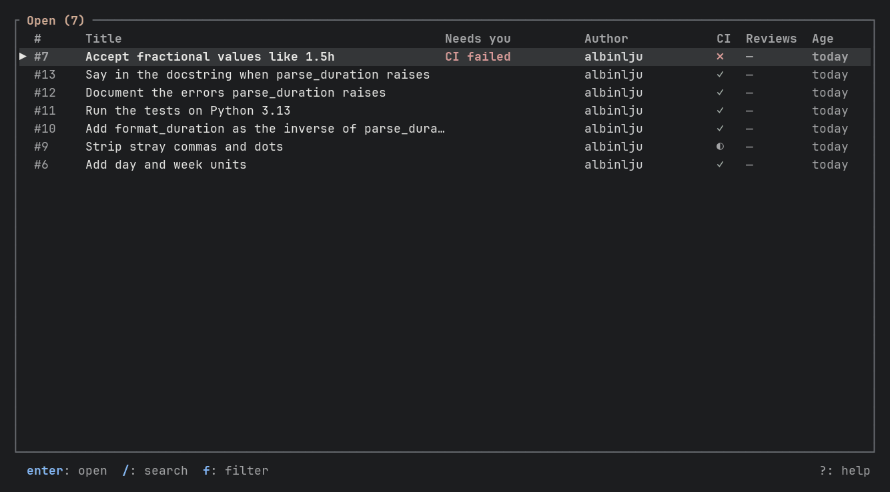

# tuipr

A terminal UI for pull requests. Two views: the list of PRs, and the PR you
opened. Read, comment, review, merge and decline without leaving the terminal,
next to your editor, git client and coding agent.

The list opens sorted by what needs you, with the reason beside each PR, and a
merge that cannot go through says why. It is not a replacement for the web UI,
and it stays small on purpose.



The pull requests in the recording are from a small throwaway demo repository.

**Where it is going.** Pull requests written by agents, and reviews written by
AI, are becoming most of what a reviewer sees. The plan is to make them
first-class: marked as AI, summarized in the header, and handed back to a
coding agent. None of that is built yet; [FEATURES.md](FEATURES.md) has the
plan and what exists.

**Status:** early. It is used daily by its author. Prebuilt binaries come with
tagged releases.

## Providers

| Provider | How it connects | Notes |
| --- | --- | --- |
| GitHub | the [`gh`](https://cli.github.com) CLI | uses your existing `gh auth login` |
| Bitbucket Data Center | REST with a personal access token | stored in the OS keyring; **listing has been seen working on one real server; everything else is tested only against a mock of the documented API** |

Bitbucket Cloud and GitLab are on the roadmap, not supported. Atlassian ends
Data Center licence sales on 2028-03-30 and support on 2029-03-28, so the
Bitbucket Data Center provider is in maintenance: bugs are fixed, nothing new
is added for it.

The provider is detected from the `origin` remote of the repository you run
tuipr in.

## Install

**Platforms.** macOS and Linux, on arm64 and x86_64, are built and tested in
CI. Windows is not built or tested: the browser and clipboard code has Windows
paths, but nothing has run them.

**Prebuilt binary.** Tagged releases attach tarballs for macOS and Linux
(arm64 and x86_64) to GitHub Releases, with checksums. Unpack it and put
`tuipr` on your `PATH`. On macOS you may need
`xattr -d com.apple.quarantine tuipr` because the binary is not notarized yet.

**From source.** With a recent Rust toolchain (the repo pins 1.95 in
`rust-toolchain.toml`, which `rustup` installs automatically):

```sh
cargo install --path .
```

Requirements at runtime: `git`, and for GitHub the `gh` CLI, authenticated for
the host.

## Use

```sh
cd path/to/a/repo
tuipr                  # open the PR browser for this repo
tuipr -C path/to/repo  # same, as if started in that directory
tuipr auth login       # Bitbucket Data Center: store a personal access token
tuipr --version
tuipr --help
```

For Bitbucket Data Center, run `tuipr auth login` once per host. The token is
kept in the OS keyring. For GitHub, run `gh auth login` instead.

Press `?` in any view for the keys that are available right now. Actions the
connected provider does not support are hidden; actions blocked by the PR's
state (for example merging with conflicts) stay visible and say why.

### Keys

| Key | List | PR |
| --- | --- | --- |
| `j` / `k` | move | scroll |
| `enter` | open PR | open / view |
| `/` | search title and author | search (diff, commits) |
| `f` | filter by status | |
| `s` | sort: needs you first / newest first | |
| `L` | load more PRs, while the view has more unread | |
| `1`-`5` | | select tab |
| `h` / `l` | | previous / next tab, on every tab (in a diff, `enter`, `esc` and the arrow keys move between the file tree and the code) |
| `a` | | submit review verdict |
| `v` | | start or finish a batched review |
| `m` / `x` | | merge / close or decline, and `x` reopens a declined PR; the merge dialog lists what blocks it |
| `c` `r` `e` `d` `R` | | comment, reply, edit, delete, resolve thread |
| `o` / `y` | open / copy link | open / copy link |
| `F` | refresh | refresh |
| `esc` | clear search | back |
| `q` | quit | quit |

The list starts with the open PRs (drafts included), read a page at a time: the
list appears with the first page and the rest are added as they arrive, in
arrival order, with "loading more..." in the heading. When the reading ends the
list takes its order, so what needs you moves to the top once. Up to 90 open
PRs are read on their own, which is the whole list on most repositories. If
there are more, the heading says "more unread" and `L` reads 90 more. Merged
and declined PRs are read only when you switch to that view, with a spinner
while they load, and then only the most recent ones: 30 per group on GitHub, 25
on Bitbucket. The All view reads whichever groups are still missing. In the
Merged, Declined and All views, `L` reads the next older batch for as long as
there is one, and the heading says "recent" until everything is loaded. The
footer shows `L: more` only when there is more to read. A refresh keeps as much
as you have already loaded. Search covers the PRs that are loaded.

The list opens sorted by what needs you. A "Needs you" column, shown at 90
columns or wider and only when some row has a reason, says why:

| Reason | Meaning |
| --- | --- |
| `changes requested` | your PR, a reviewer asked for changes |
| `CI failed` | your PR, the checks failed |
| `review requested` | someone else's PR, you were asked to review it |
| `approved` | your PR, every reviewer approved, so merging is your call |

Only open PRs ask for anything. Team review requests on GitHub are not
counted yet. Press `s` for plain newest-first order, or set `sort = "recent"`.

Drafts (comment editor text and queued review comments) are saved locally and
survive a restart.

Copying a link uses the system clipboard helper (`pbcopy`, `wl-copy`, `xclip`,
`xsel`, PowerShell). Over SSH, or when no helper works, tuipr asks the terminal
to set the clipboard instead (OSC 52). The terminal cannot confirm that, so the
message says "sent to terminal clipboard". Inside tmux this needs
`set -g set-clipboard on`; some terminals disable OSC 52 by default.

## Configure

`~/.config/tuipr/config.toml` (or `$XDG_CONFIG_HOME/tuipr/config.toml`):

```toml
theme = "graphite"   # graphite (default), slate, gruvbox, catppuccin, terminal
sort = "attention"   # attention (default) or recent
```

`TUIPR_THEME` overrides the file.

## Documentation

- [FEATURES.md](FEATURES.md): what is built and where the product is going
- [ARCHITECTURE.md](ARCHITECTURE.md): how the code is organised and why
- [IMPROVEMENTS.md](IMPROVEMENTS.md): engineering and tooling backlog
- [RELEASING.md](RELEASING.md): how a release is cut

## Develop

```sh
cargo fmt --all -- --check
cargo clippy --locked --all-targets -- -D warnings
cargo test --locked
cargo deny check        # cargo install cargo-deny --locked
```

CI runs the same four checks. `target/` grows quickly (several GB); `cargo
clean` is always safe.

## License

[MIT](LICENSE)
